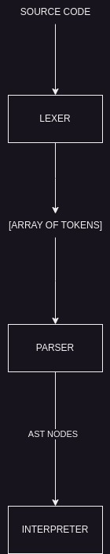

# ToyLang

This project is about learning how to create your own programming language.
We will be using typescript.
using tsc typescript code will be transpilled to javascript

Future Aspect: Implement This in Rust.

